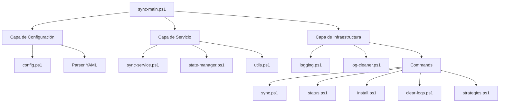
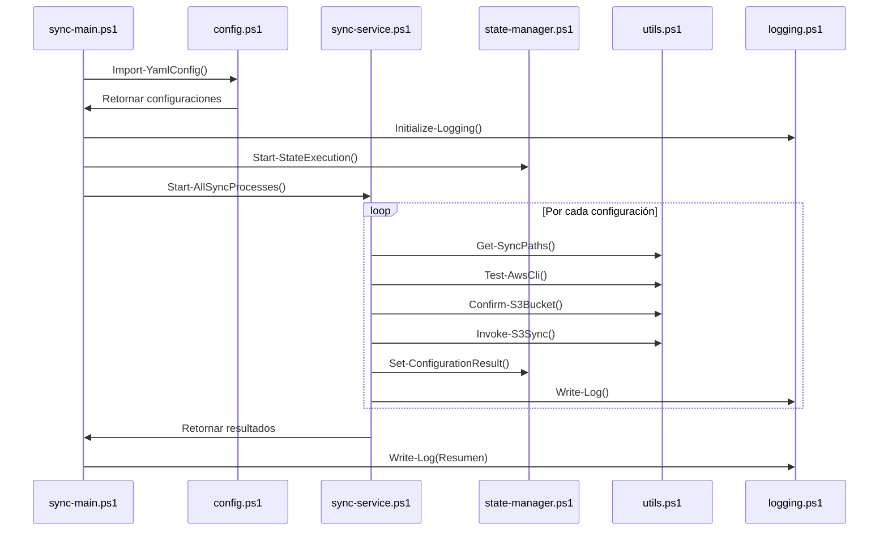
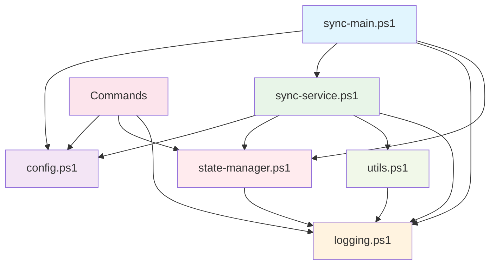
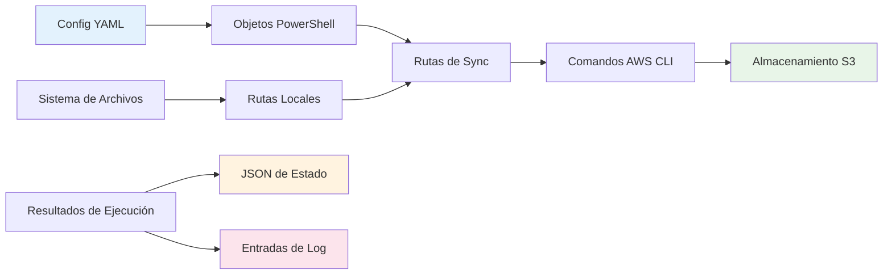
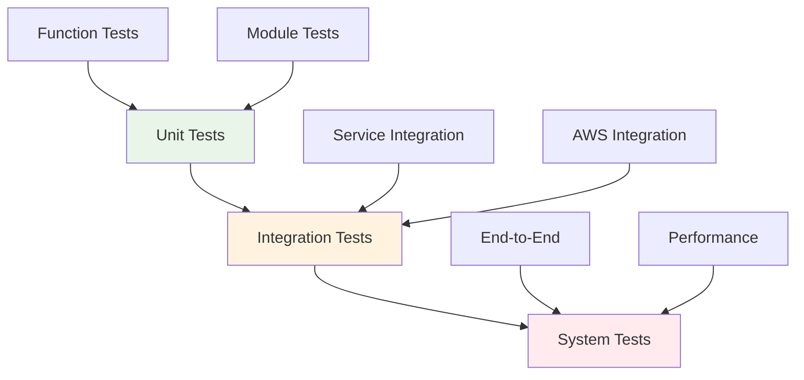

# 🏗️ AWS S3 Sync - Guía de Arquitectura y Desarrollo

> **🌐 Idioma**: [English](README.md) | Español

[](https://github.com/PowerShell/PowerShell)
[](https://aws.amazon.com/cli/)
[]()

> **Documentación para Desarrolladores** del sistema modular de sincronización AWS S3. Esta guía se enfoca en la arquitectura técnica, diseño de componentes y patrones de desarrollo utilizados en la aplicación.

---

## 📋 Tabla de Contenidos

- [🎯 Visión General del Sistema](#-visión-general-del-sistema)
- [🏗️ Patrones de Arquitectura](#️-patrones-de-arquitectura)
- [📁 Estructura de Módulos](#-estructura-de-módulos)
- [🔄 Interacción de Componentes](#-interacción-de-componentes)
- [💾 Flujo de Datos](#-flujo-de-datos)
- [🔧 Guías de Desarrollo](#-guías-de-desarrollo)
- [🛠️ Puntos de Extensión](#️-puntos-de-extensión)
- [🧪 Estrategia de Testing](#-estrategia-de-testing)

---

## 🎯 Visión General del Sistema

El sistema AWS S3 Sync está construido usando una **arquitectura modular** con clara separación de responsabilidades, siguiendo mejores prácticas de PowerShell y patrones empresariales.

### 🎨 **Principios de Diseño**

1. **📦 Responsabilidad Única**: Cada módulo maneja un aspecto específico
2. **🔄 Inyección de Dependencias**: Las configuraciones y dependencias se inyectan
3. **💾 Gestión de Estado**: Seguimiento persistente de estado entre ejecuciones
4. **🛡️ Aislamiento de Errores**: Las fallas en un componente no afectan otros
5. **📊 Observable**: Logging y monitoreo integral
6. **⚙️ Configurable**: Gestión de configuración basada en YAML

### 🧱 **Componentes Principales**



---

## 🏗️ Patrones de Arquitectura

### 🎯 **Arquitectura en Capas**

El sistema sigue una **arquitectura de 3 capas**:

#### **1. Capa de Presentación (Puntos de Entrada)**
- `sync-main.ps1` - Orquestador principal
- `src/commands/*.ps1` - Implementaciones de comandos CLI

#### **2. Capa de Lógica de Negocio (Servicios)**
- `sync-service.ps1` - Lógica principal de sincronización
- `state-manager.ps1` - Persistencia y gestión de estado
- `utils.ps1` - Utilidades de negocio y operaciones AWS

#### **3. Capa de Infraestructura (Soporte)**
- `config.ps1` - Gestión de configuración y parsing YAML
- `logging.ps1` - Infraestructura de logging centralizada
- `log-cleaner.ps1` - Rotación y limpieza de logs

### 🔧 **Patrón de Módulo**

Cada módulo de PowerShell sigue una estructura consistente:

```powershell
#region Encabezado del Módulo
# Descripción y propósito
#endregion

#region Funciones Privadas
# Detalles de implementación interna
#endregion

#region Funciones Públicas
# Funciones exportadas de la API
#endregion

#region Inicialización
# Configuración y validación del módulo
#endregion
```

### 💾 **Patrón de Gestión de Estado**

El sistema implementa un **patrón de estado persistente** usando JSON:

```json
{
  "lastExecution": { /* Estado de ejecución global */ },
  "configurationHistory": [ /* Historial de estado por configuración */ ]
}
```

---

## 📁 Estructura de Módulos

### ⚙️ **config.ps1 - Gestión de Configuración**

**Propósito**: Carga y gestión centralizada de configuración

**Componentes Clave**:
- Clase `SyncConfiguration` - Contenedor de configuración
- Parsing YAML con módulo `powershell-yaml`
- Validación de configuración y valores por defecto

**Patrón de Arquitectura**: Gestor de Configuración Singleton

```powershell
# Diseño de clase principal
class SyncConfiguration {
    [string]$ConfigFile
    [int]$LogRetentionMonths
    [string]$LogDir
    [string]$StateFile
    [array]$SyncConfigurations
}
```

**API Pública**:
- `Import-YamlConfig()` - Cargar configuración desde YAML
- `Get-EnabledSyncConfigurations()` - Obtener configuraciones de sync activas
- `Get-LogDirectory()`, `Get-StateFile()` - Accesores de configuración

### 🔄 **sync-service.ps1 - Lógica de Negocio Principal**

**Propósito**: Orquesta el proceso de sincronización

**Componentes Clave**:
- Orquestación de procesos
- Interacción con AWS S3
- Manejo y recuperación de errores
- Agregación de resultados

**Patrón de Arquitectura**: Capa de Servicio con Patrón Command

```powershell
# Funciones de orquestación principales
function Start-AllSyncProcesses($TargetDate)    # Procesar todas las configs
function Start-SyncProcess($TargetDate, $Config) # Procesar una sola config
```

**Diseño de Flujo de Trabajo**:
1. **Fase de Validación**: Verificar prerrequisitos y rutas
2. **Fase de Ejecución**: Ejecutar sincronización AWS S3 con opciones
3. **Fase de Resultados**: Capturar y registrar resultados
4. **Fase de Estado**: Actualizar estado persistente

### 💾 **state-manager.ps1 - Persistencia de Estado**

**Propósito**: Gestiona el estado de la aplicación entre ejecuciones

**Componentes Clave**:
- Persistencia de estado basada en JSON
- Seguimiento de historial de ejecuciones
- Gestión de estado específico por configuración
- Reportes y analíticos de estado

**Patrón de Arquitectura**: Patrón Repository para Estado

```powershell
# Operaciones de estado
function Get-State()                    # Cargar estado actual
function Set-State($StateData)          # Persistir estado
function Start-StateExecution($Date)    # Comenzar nueva ejecución
function Set-ConfigurationResult(...)   # Registrar resultado de config
function Get-StateReport()              # Generar reporte de estado
```

**Schema de Estado**:
```json
{
  "lastExecution": {
    "timestamp": "ISO-8601",
    "success": "boolean",
    "totalConfigurations": "number",
    "successfulConfigurations": "number",
    "failedConfigurations": "number"
  },
  "configurationHistory": [{
    "name": "string",
    "timestamp": "ISO-8601",
    "targetDate": "string",
    "success": "boolean",
    "localPath": "string",
    "s3Path": "string",
    "duration": "timespan",
    "filesTransferred": "number",
    "message": "string"
  }]
}
```

### 🔧 **utils.ps1 - Funciones de Utilidad**

**Propósito**: Funciones de utilidad reutilizables y operaciones AWS

**Componentes Clave**:
- Integración con AWS CLI
- Gestión de buckets S3
- Construcción de rutas
- Operaciones del sistema de archivos

**Patrón de Arquitectura**: Módulo de Utilidades/Helper

```powershell
# Utilidades principales
function Test-AwsCli()                  # Verificar disponibilidad de AWS CLI
function Confirm-S3Bucket($Name)        # Asegurar que existe el bucket S3
function Get-SyncPaths($Date, $Config)  # Construir rutas de sincronización
function Invoke-S3Sync($Local, $S3)     # Ejecutar sincronización S3
```

### 📝 **logging.ps1 - Infraestructura de Logging**

**Propósito**: Logging centralizado con rotación

**Componentes Clave**:
- Rotación de logs mensual
- Logging multi-nivel (INFO, WARNING, ERROR, SUCCESS)
- Limpieza automática de logs

**Patrón de Arquitectura**: Servicio de Infraestructura

```powershell
# API de Logging
function Write-Log($Message, $Level)     # Escribir entrada de log
function Initialize-Logging()           # Configurar logging
function Remove-OldLogs()               # Rotación de logs
```

### 🧹 **log-cleaner.ps1 - Gestión de Logs**

**Propósito**: Limpieza avanzada y mantenimiento de logs

**Componentes Clave**:
- Políticas de retención configurables
- Gestión de espacio
- Capacidades de archivado de logs

**Patrón de Arquitectura**: Servicio de Mantenimiento

### 📁 **commands/ - Comandos CLI**

**Propósito**: Implementaciones de interfaz de línea de comandos

**Componentes**:
- `sync.ps1` - Comando de sincronización manual
- `status.ps1` - Reporte de estado del sistema
- `install.ps1` - Instalación de prerrequisitos
- `clear-logs.ps1` - Utilidades de limpieza de logs
- `strategies.ps1` - Estrategias alternativas de sincronización

**Patrón de Arquitectura**: Patrón Command con Facade

---

## 🔄 Interacción de Componentes

### 📊 **Flujo de Ejecución**



### 🔗 **Gráfico de Dependencias**



---

## 💾 Flujo de Datos

### 📥 **Fuentes de Datos de Entrada**

1. **Configuración YAML** (`sync-config.yaml`)
   - Configuraciones globales
   - Configuraciones de sincronización
   - Parámetros AWS

2. **Parámetros de Línea de Comandos**
   - Fecha objetivo
   - Opciones de ejecución

3. **Archivo de Estado** (`state.json`)
   - Historial de ejecuciones previas
   - Estado de configuración

### 📤 **Destinos de Datos de Salida**

1. **Archivos de Log** (`log/sync_YYYY-MM.log`)
   - Logs de ejecución
   - Detalles de errores
   - Métricas de rendimiento

2. **Archivo de Estado** (`state.json`)
   - Estado de ejecución actualizado
   - Resultados de configuración

3. **AWS S3**
   - Archivos sincronizados
   - Estructuras de carpetas

### 🔄 **Pipeline de Transformación de Datos**



---

## 🔧 Guías de Desarrollo

### 📝 **Estándares de Codificación**

#### **Mejores Prácticas de PowerShell**
- Usar **Verbos Aprobados** para nombres de función (`Get-`, `Set-`, `Start-`, `Stop-`)
- Implementar **Validación de Parámetros** con `[ValidateSet]`, `[ValidateScript]`
- Usar **Splatting** para pasar parámetros complejos
- Implementar **Manejo de Errores** con `try/catch/finally`

#### **Diseño de Funciones**
```powershell
function Verbo-Sustantivo {
    param(
        [Parameter(Mandatory = $true)]
        [ValidateNotNullOrEmpty()]
        [string] $ParametroRequerido,
        
        [Parameter(Mandatory = $false)]
        [ValidateSet("Opcion1", "Opcion2")]
        [string] $ParametroOpcional = "Opcion1"
    )
    
    try {
        # Implementación
        return $resultado
    }
    catch {
        Write-Log -Message "Error en Verbo-Sustantivo: $_" -Level "ERROR"
        throw
    }
}
```

#### **Patrón de Manejo de Errores**
```powershell
try {
    # Lógica principal
    $resultado = Invoke-Operation
    Write-Log -Message "Operación exitosa" -Level "SUCCESS"
    return $resultado
}
catch {
    $errorMsg = "Operación falló: $_"
    Write-Log -Message $errorMsg -Level "ERROR"
    
    # Para errores no críticos, continuar procesamiento
    if ($ContinueOnError) {
        return $null
    }
    
    # Para errores críticos, detener ejecución
    throw $errorMsg
}
```

### 🧪 **Enfoque de Testing**

#### **Estructura de Unit Testing**
```powershell
# Archivo de test: Tests/config.tests.ps1
Describe "Gestión de Configuración" {
    Context "Carga de YAML" {
        It "Debería cargar configuración YAML válida" {
            $config = Import-YamlConfig -ScriptRoot $testRoot
            $config | Should -Not -BeNullOrEmpty
        }
        
        It "Debería validar campos requeridos" {
            { Import-YamlConfig -ScriptRoot $invalidRoot } | Should -Throw
        }
    }
}
```

#### **Testing de Integración**
```powershell
# Archivo de test: Tests/integration.tests.ps1
Describe "Sincronización End-to-End" {
    BeforeAll {
        # Configurar entorno de prueba
        $testConfig = New-TestConfiguration
        $testFiles = New-TestFiles
    }
    
    It "Debería sincronizar archivos de prueba a S3" {
        $result = Start-SyncProcess -TargetDate $testDate -SyncConfig $testConfig
        $result | Should -BeTrue
    }
    
    AfterAll {
        # Limpiar recursos de prueba
        Remove-TestFiles
    }
}
```

---

## 🛠️ Puntos de Extensión

### 🔌 **Agregar Nuevos Comandos**

Crear nuevos comandos en `src/commands/`:

```powershell
# src/commands/nuevo-comando.ps1
<#
.SYNOPSIS
    Nuevo comando para el sistema AWS S3 Sync
#>

param(
    [Parameter(Mandatory = $false)]
    [string] $Parametro1
)

# Obtener raíz del proyecto (dos niveles arriba desde src/commands)
$ProjectRoot = Split-Path (Split-Path $PSScriptRoot -Parent) -Parent

# Importar módulos requeridos
. (Join-Path $ProjectRoot "src\config.ps1")
. (Join-Path $ProjectRoot "src\logging.ps1")

function Invoke-NuevoComando {
    # Implementación
}

# Ejecutar si se llama directamente
if ($MyInvocation.InvocationName -eq $MyInvocation.MyCommand.Name) {
    Invoke-NuevoComando
}
```

### 🔧 **Agregar Nuevas Estrategias de Sync**

Extender `src/commands/strategies.ps1`:

```powershell
function Invoke-EstrategiaSyncPersonalizada {
    param(
        [string] $RutaLocal,
        [string] $RutaS3,
        [array] $Opciones
    )
    
    # Lógica de sincronización personalizada
    return @{
        Success = $true
        FilesTransferred = $count
        Message = "Sync personalizado completado"
    }
}
```

### 📊 **Agregar Nuevos Reportes de Estado**

Extender `src/state-manager.ps1`:

```powershell
function Get-ReporteEstadoPersonalizado {
    $state = Get-State
    
    # Generación de reporte personalizado
    return @{
        MetricaPersonalizada1 = $valor1
        MetricaPersonalizada2 = $valor2
    }
}
```

### 🔍 **Agregar Nuevos Validadores**

Extender `src/utils.ps1`:

```powershell
function Test-ValidacionPersonalizada {
    param(
        [PSCustomObject] $Config
    )
    
    # Lógica de validación personalizada
    if (-not $validacionPasada) {
        throw "Validación personalizada falló: $razon"
    }
}
```

---

## 🧪 Estrategia de Testing

### 🎯 **Pirámide de Testing**



### 🔬 **Categorías de Test**

#### **1. Unit Tests**
- Validación de funciones individuales
- Verificación de manejo de errores
- Validación de entrada/salida
- Mock de dependencias externas

#### **2. Integration Tests**
- Testing de interacción de módulos
- Integración con AWS CLI
- Operaciones del sistema de archivos
- Validación de persistencia de estado

#### **3. System Tests**
- Testing de flujo de trabajo completo
- Benchmarking de rendimiento
- Testing de recuperación de errores
- Escenarios multi-configuración

### 🏃 **Ejecutar Tests**

```powershell
# Instalar Pester si no está disponible
if (-not (Get-Module -ListAvailable Pester)) {
    Install-Module -Name Pester -Force -Scope CurrentUser
}

# Ejecutar todos los tests
Invoke-Pester -Path "Tests/" -OutputFormat "NUnitXml" -OutputFile "TestResults.xml"

# Ejecutar categoría específica de test
Invoke-Pester -Path "Tests/unit/" -Tag "Unit"
Invoke-Pester -Path "Tests/integration/" -Tag "Integration"
```

---

## 🚀 **Flujo de Desarrollo**

### 🔄 **Proceso de Desarrollo Recomendado**

1. **📋 Planificación**
   - Definir requerimientos y alcance
   - Diseñar interfaces de componentes
   - Planificar estrategia de testing

2. **🔧 Implementación**
   - Seguir estándares de codificación
   - Implementar funcionalidad principal
   - Agregar manejo integral de errores

3. **🧪 Testing**
   - Escribir unit tests primero (TDD)
   - Implementar integration tests
   - Realizar system testing

4. **📝 Documentación**
   - Actualizar documentación inline
   - Actualizar esta guía de arquitectura
   - Actualizar documentación de usuario

5. **🚀 Despliegue**
   - Validar en entorno de prueba
   - Desplegar a producción
   - Monitorear logs de ejecución

### 🛠️ **Configuración del Entorno de Desarrollo**

```powershell
# Clonar repositorio
git clone <repository-url>
cd aws-s3-sync

# Instalar dependencias de desarrollo
.\src\commands\install.ps1

# Instalar framework de testing
Install-Module -Name Pester -Force -Scope CurrentUser

# Ejecutar validación inicial
.\src\commands\status.ps1
```

---

## 📚 **Recursos Adicionales**

### 🔗 **Documentación Relacionada**
- [Guía de Usuario](../README.md) - Documentación para usuarios finales
- [Guía de Configuración](../sync-config.yaml) - Ejemplos de configuración YAML
- [Mejores Prácticas de PowerShell](https://docs.microsoft.com/en-us/powershell/scripting/learn/ps101/00-introduction)
- [Documentación AWS CLI](https://docs.aws.amazon.com/cli/)

### 🤝 **Contribuciones**
- Seguir los estándares de codificación definidos en este documento
- Escribir tests comprensivos para nuevas funcionalidades
- Actualizar documentación para cualquier cambio arquitectónico
- Usar mensajes de commit descriptivos

### 📞 **Soporte**
Para preguntas técnicas sobre la arquitectura:
- Revisar esta documentación primero
- Verificar unit e integration tests existentes
- Examinar los archivos de estado y logs para información de runtime
- Seguir los patrones de troubleshooting en la guía principal de usuario

---

**🎯 Esta guía de arquitectura sirve como base para entender, mantener y extender el sistema AWS S3 Sync. Para documentación enfocada en usuarios, ver el [README.md](../README.md) principal.**