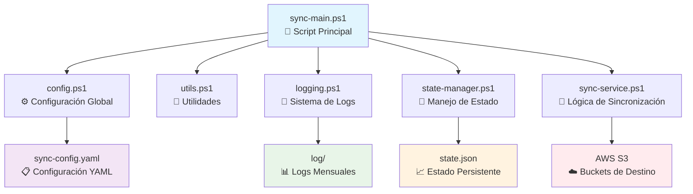

# 🔄 AWS S3 Sync - Sistema Modular Multi-Configuración

[](https://github.com/PowerShell/PowerShell)
[](https://aws.amazon.com/cli/)
[](https://yaml.org/)

> **Sistema robusto y escalable** para sincronizar automáticamente múltiples carpetas diarias con diferentes buckets de AWS S3, con configuración YAML, manejo de logs, estado persistente y rotación automática.

---

## 📋 Tabla de Contenidos

- [🎯 Características Principales](#-características-principales)
- [🏗️ Arquitectura del Sistema](#️-arquitectura-del-sistema)
- [📁 Estructura del Proyecto](#-estructura-del-proyecto)
- [⚙️ Configuración Detallada](#️-configuración-detallada)
- [🚀 Instalación y Setup](#-instalación-y-setup)
- [💻 Uso y Ejecución](#-uso-y-ejecución)
- [📊 Logs y Monitoreo](#-logs-y-monitoreo)
- [🔧 Mantenimiento](#-mantenimiento)
- [🛠️ Solución de Problemas](#️-solución-de-problemas)
- [📈 Programación Automática](#-programación-automática)

---

## 🎯 Características Principales

### ✨ **Funcionalidades Core**
- 🔄 **Sincronización Multi-Configuración**: Maneja múltiples orígenes locales con diferentes buckets S3
- 📝 **Configuración YAML**: Archivo de configuración flexible y fácil de mantener
- 🔁 **Ejecución Secuencial**: Procesa todas las configuraciones en orden definido
- 📊 **Logs Centralizados**: Sistema de logging unificado con rotación automática mensual
- 💾 **Estado Persistente**: Seguimiento detallado del estado por configuración
- ⚙️ **Opciones Personalizadas**: Diferentes parámetros de sincronización por configuración
- 🗂️ **Estructura S3 Flexible**: Personalización completa de la estructura de carpetas en S3

### 🛡️ **Características de Seguridad y Confiabilidad**
- ✅ **Validación de Prerrequisitos**: Verificación automática de dependencias
- 🚨 **Manejo de Errores**: Control exhaustivo de errores con logs detallados
- 🔄 **Recuperación Automática**: Continuación de proceso aunque falle una configuración
- 📈 **Monitoreo de Estado**: Historial completo de todas las ejecuciones
- 🔐 **Integración AWS**: Uso de credenciales AWS existentes de forma segura

---

## 🏗️ Arquitectura del Sistema

El sistema está diseñado con una **arquitectura modular** que separa responsabilidades y facilita el mantenimiento:



### 🔄 **Flujo de Ejecución**

1. **Inicialización** → Carga de módulos y configuración YAML
2. **Validación** → Verificación de prerrequisitos del sistema
3. **Procesamiento** → Ejecución secuencial de cada configuración habilitada
4. **Logging** → Registro detallado de cada operación
5. **Estado** → Actualización del archivo de estado JSON
6. **Finalización** → Resumen de resultados y limpieza

---

## 📁 Estructura del Proyecto

```
📦 aws-s3-sync/
├── 📄 sync-main.ps1              # 🎯 Script principal de ejecución
├── 📄 sync-config.yaml           # ⚙️ Archivo de configuración YAML
├── 📄 README.md                  # 📚 Esta documentación
├── 📄 state.json                 # 📊 Estado del sistema (auto-generado)
├── 📁 src/                       # 🏗️ Módulos del sistema
│   ├── 📄 config.ps1             # ⚙️ Configuración global y parser YAML
│   ├── 📄 utils.ps1              # 🔧 Funciones de utilidad
│   ├── 📄 logging.ps1            # 📝 Sistema de logging y rotación
│   ├── 📄 state-manager.ps1      # 💾 Manejo del archivo de estado JSON
│   ├── 📄 sync-service.ps1       # 🔄 Lógica principal de sincronización
│   ├── 📄 sync.ps1               # 🔄 Script original (compatibilidad)
│   └── 📄 install-requirements.ps1 # 📦 Instalación de prerrequisitos
└── 📁 log/                       # 📊 Logs del sistema (auto-generado)
    ├── 📄 sync_2025-01.log       # 📅 Log mensual enero 2025
    ├── 📄 sync_2025-02.log       # 📅 Log mensual febrero 2025
    └── 📄 ...                    # 📅 Logs mensuales anteriores
```

---

## ⚙️ Configuración Detallada

### 📋 **Archivo de Configuración Principal: `sync-config.yaml`**

El sistema utiliza un archivo YAML que define tanto la configuración global como las configuraciones específicas de sincronización:

#### 🌐 **Configuración Global**

```yaml
global:
  log_retention_months: 12        # 📅 Meses de retención de logs
  log_directory: "log"            # 📁 Directorio de logs
  state_file: "state.json"        # 💾 Archivo de estado
```

| Parámetro | Tipo | Descripción | Valor por Defecto |
|-----------|------|-------------|-------------------|
| `log_retention_months` | `int` | Número de meses que se conservan los logs antes de la rotación automática | `12` |
| `log_directory` | `string` | Carpeta donde se almacenan los logs (relativa al script principal) | `"log"` |
| `state_file` | `string` | Nombre del archivo JSON donde se guarda el estado del sistema | `"state.json"` |

#### 🔄 **Configuraciones de Sincronización**

```yaml
sync_configurations:
  - name: "Documentos Corporativos"
    description: "Sincronización de documentos diarios corporativos"
    enabled: true
    local_base_path: "C:\\Datos\\Documentos"
    bucket_name: "corp-documentos-backup"
    s3_path_structure: "{year}/{month}/{day}"
    date_folder_format: "yyyy-MM-dd"
    sync_options:
      - "--exclude=*.tmp"
      - "--exclude=*.log"
```

### 📊 **Parámetros de Configuración de Sincronización**

| Parámetro | Tipo | Requerido | Descripción |
|-----------|------|-----------|-------------|
| `name` | `string` | ✅ | **Identificador único** de la configuración. Se usa en logs y estado |
| `description` | `string` | ✅ | **Descripción** detallada de qué hace esta configuración |
| `enabled` | `boolean` | ✅ | **Habilitar/Deshabilitar** esta configuración (`true`/`false`) |
| `local_base_path` | `string` | ✅ | **Ruta base local** donde están las carpetas diarias a sincronizar |
| `bucket_name` | `string` | ✅ | **Nombre del bucket S3** (sin prefijo `s3://`) |
| `s3_path_structure` | `string` | ❌ | **Estructura de carpetas en S3**. Usa placeholders: `{year}`, `{month}`, `{day}` |
| `date_folder_format` | `string` | ❌ | **Formato de las carpetas** de fecha locales (formato .NET) |
| `sync_options` | `array` | ❌ | **Opciones adicionales** para el comando `aws s3 sync` |

### 🎨 **Placeholders para Estructura S3**

| Placeholder | Descripción | Ejemplo |
|-------------|-------------|---------|
| `{year}` | Año de 4 dígitos | `2025` |
| `{month}` | Mes de 2 dígitos | `01`, `12` |
| `{day}` | Día de 2 dígitos | `01`, `31` |

**Ejemplos de estructuras S3:**
- `"{year}/{month}/{day}"` → `2025/01/15`
- `"backup/{year}/{month}/{day}"` → `backup/2025/01/15`
- `"datos/{year}/mes-{month}/dia-{day}"` → `datos/2025/mes-01/dia-15`

### 🔧 **Opciones de Sincronización Comunes**

| Opción | Descripción | Ejemplo de Uso |
|--------|-------------|----------------|
| `--exclude="*.tmp"` | Excluir archivos temporales | Archivos de trabajo |
| `--exclude="*.log"` | Excluir archivos de log | Logs del sistema |
| `--exclude="*.thumbs"` | Excluir miniaturas | Archivos de imágenes |
| `--include="*.pdf"` | Incluir solo PDFs | Documentos específicos |
| `--size-only` | Comparar solo por tamaño | Sincronización rápida |
| `--dryrun` | Simulación sin cambios | Pruebas de configuración |

---

## 🚀 Instalación y Setup

### 📋 **Prerrequisitos del Sistema**

- 🖥️ **Windows 10/11** con PowerShell 5.1 o superior
- ☁️ **AWS CLI** instalado y configurado
- 🔐 **Credenciales AWS** válidas con permisos S3
- 📝 **Permisos de escritura** en la carpeta del proyecto

### ⚡ **Instalación Rápida**

1. **📦 Ejecutar Script de Instalación:**
   ```powershell
   .\src\install-requirements.ps1
   ```
   Este script instala automáticamente:
   - Módulo PowerShell-Yaml
   - Validación de AWS CLI
   - Configuración de permisos de ejecución

2. **🔐 Configurar AWS CLI** (si no está configurado):
   ```bash
   aws configure
   ```
   Proporcionar:
   - AWS Access Key ID
   - AWS Secret Access Key
   - Región por defecto
   - Formato de salida (json)

3. **⚙️ Personalizar Configuración:**
   - Editar `sync-config.yaml` con tus configuraciones específicas
   - Verificar rutas locales y nombres de buckets
   - Ajustar opciones de sincronización según necesidades

4. **✅ Verificar Instalación:**
   ```powershell
   .\sync-main.ps1 -TargetDate (Get-Date).AddDays(-1)
   ```

### 🔧 **Configuración Manual de Prerrequisitos**

Si prefieres instalar manualmente:

1. **PowerShell-Yaml:**
   ```powershell
   Install-Module -Name powershell-yaml -Force -Scope CurrentUser
   ```

2. **AWS CLI:**
   - Descargar desde: https://aws.amazon.com/cli/
   - Verificar instalación: `aws --version`

3. **Permisos de Ejecución:**
   ```powershell
   Set-ExecutionPolicy -ExecutionPolicy RemoteSigned -Scope CurrentUser
   ```

---

## 💻 Uso y Ejecución

### 🎯 **Ejecución del Script Principal**

El archivo `sync-main.ps1` es el punto de entrada principal del sistema:

#### **Uso Básico:**

```powershell
# Sincronizar día anterior (comportamiento por defecto)
.\sync-main.ps1

# Sincronizar fecha específica
.\sync-main.ps1 -TargetDate (Get-Date "2025-01-15")

# Sincronizar hace 3 días
.\sync-main.ps1 -TargetDate (Get-Date).AddDays(-3)
```

#### **Parámetros del Script:**

| Parámetro | Tipo | Descripción | Valor por Defecto |
|-----------|------|-------------|-------------------|
| `TargetDate` | `DateTime` | Fecha específica para sincronizar | Día anterior |

### 🔄 **Flujo de Procesamiento**

1. **🔍 Carga de Configuración:**
   - Lee `sync-config.yaml`
   - Valida estructura y parámetros
   - Filtra configuraciones habilitadas

2. **✅ Validación de Prerrequisitos:**
   - Verifica AWS CLI disponible
   - Comprueba credenciales AWS
   - Valida permisos de escritura

3. **🔄 Procesamiento Secuencial:**
   - Itera sobre cada configuración habilitada
   - Construye rutas local y S3
   - Ejecuta sincronización
   - Registra resultado en estado y logs

4. **📊 Finalización:**
   - Genera resumen de resultados
   - Actualiza estado global
   - Rota logs antiguos

### 📁 **Estructura de Carpetas Esperada**

El sistema espera que las carpetas locales sigan el formato de fecha especificado:

```
C:\Datos\Documentos\
├── 📁 2025-01-13/
├── 📁 2025-01-14/
├── 📁 2025-01-15/
└── 📁 2025-01-16/
```

---

## 📊 Logs y Monitoreo

### 📝 **Sistema de Logs**

El sistema genera logs mensuales detallados en la carpeta `log/`:

#### **Estructura de Logs:**
```
log/
├── 📄 sync_2025-01.log    # Log del mes actual
├── 📄 sync_2024-12.log    # Log del mes anterior
└── 📄 sync_2024-11.log    # Logs históricos
```

#### **Formato de Entradas de Log:**
```
[2025-01-20 10:00:00] [INFO] === Iniciando proceso de sincronización AWS S3 ===
[2025-01-20 10:00:01] [INFO] Procesando configuración: 'Documentos Corporativos'
[2025-01-20 10:00:02] [SUCCESS] [Documentos Corporativos] Sincronización exitosa
[2025-01-20 10:00:03] [ERROR] [Fotos Diarias] Error: Carpeta no encontrada
```

#### **Niveles de Log:**

| Nivel | Icono | Descripción | Cuándo se Usa |
|-------|-------|-------------|---------------|
| `INFO` | ℹ️ | Información general | Inicio/fin de procesos, estados |
| `SUCCESS` | ✅ | Operación exitosa | Sincronizaciones completadas |
| `WARNING` | ⚠️ | Advertencia | Configuraciones deshabilitadas |
| `ERROR` | ❌ | Error | Fallos en sincronización |

### 💾 **Archivo de Estado: `state.json`**

Mantiene un historial completo de todas las ejecuciones:

```json
{
  "lastExecution": {
    "timestamp": "2025-01-20T10:00:00.000Z",
    "success": true,
    "totalConfigurations": 4,
    "successfulConfigurations": 3,
    "failedConfigurations": 1
  },
  "configurationHistory": [
    {
      "name": "Documentos Corporativos",
      "timestamp": "2025-01-20T10:00:02.000Z",
      "targetDate": "2025-01-19",
      "success": true,
      "localPath": "C:\\Datos\\Documentos\\2025-01-19",
      "s3Path": "s3://corp-documentos-backup/2025/01/19",
      "duration": "00:00:04",
      "filesTransferred": 15,
      "message": "Sincronización exitosa"
    }
  ]
}
```

### 🔄 **Rotación Automática de Logs**

- **Frecuencia:** Al inicio de cada ejecución
- **Retención:** Configurable (por defecto 12 meses)
- **Proceso:** Eliminación automática de logs antiguos
- **Notificación:** Se registra en el log cuando se eliminan archivos

---

## 🔧 Mantenimiento

### 📁 **Módulos del Sistema**

#### **1. `config.ps1` - Configuración Global**
```powershell
# Funciones principales:
- Import-YamlConfig          # Carga configuración YAML
- Get-GlobalConfig           # Obtiene configuración global
- Get-SyncConfigurations     # Obtiene configuraciones de sync
```

#### **2. `utils.ps1` - Utilidades**
```powershell
# Funciones de utilidad:
- Test-AndCreateFolder       # Crear carpetas si no existen
- Test-AwsCli               # Verificar AWS CLI
- Get-SyncPaths             # Construir rutas de sincronización
- Invoke-S3Sync             # Ejecutar comando de sincronización
```

#### **3. `logging.ps1` - Sistema de Logs**
```powershell
# Funciones de logging:
- Write-Log                 # Escribir mensajes en logs
- Remove-OldLogs            # Rotación automática de logs
- Initialize-Logging        # Inicializar sistema de logging
```

#### **4. `state-manager.ps1` - Manejo de Estado**
```powershell
# Funciones de estado:
- Get-State                 # Leer archivo de estado JSON
- Set-State                 # Guardar estado en JSON
- New-StateEntry            # Crear nueva entrada de estado
- Add-StateEntry            # Agregar entrada al estado
```

#### **5. `sync-service.ps1` - Lógica Principal**
```powershell
# Funciones principales:
- Start-AllSyncProcesses    # Procesar todas las configuraciones
- Start-SyncProcess         # Procesar una configuración
- Test-SystemPrerequisites  # Validar prerrequisitos
```

### 🔄 **Tareas de Mantenimiento Recomendadas**

#### **Semanalmente:**
- ✅ Revisar logs de errores en `log/sync_YYYY-MM.log`
- ✅ Verificar estado de configuraciones en `state.json`
- ✅ Comprobar espacio disponible en buckets S3

#### **Mensualmente:**
- 🔄 Revisar y actualizar configuraciones en `sync-config.yaml`
- 📊 Analizar tendencias de sincronización en logs
- 🔐 Verificar permisos y credenciales AWS

#### **Trimestralmente:**
- 📦 Actualizar AWS CLI a la última versión
- 🔧 Revisar y optimizar opciones de sincronización
- 📈 Evaluar rendimiento y tiempos de ejecución

---

## 🛠️ Solución de Problemas

### ❌ **Errores Comunes y Soluciones**

#### **1. Error: "No se puede cargar el archivo"**
```
❌ Problema: Set-ExecutionPolicy restrictions
✅ Solución:
Set-ExecutionPolicy -ExecutionPolicy RemoteSigned -Scope CurrentUser
```

#### **2. Error: "AWS CLI no encontrado"**
```
❌ Problema: AWS CLI no instalado o no en PATH
✅ Solución:
- Instalar desde: https://aws.amazon.com/cli/
- Verificar con: aws --version
- Reiniciar PowerShell después de la instalación
```

#### **3. Error: "Carpeta no encontrada"**
```
❌ Problema: La carpeta de fecha no existe en la ruta especificada
✅ Solución:
- Verificar formato de fecha en date_folder_format
- Confirmar que existe la carpeta para la fecha objetivo
- Revisar ruta en local_base_path
```

#### **4. Error: "Access Denied S3"**
```
❌ Problema: Permisos insuficientes en AWS
✅ Solución:
- Verificar credenciales AWS: aws sts get-caller-identity
- Confirmar permisos S3 en el bucket
- Revisar políticas IAM asociadas
```

#### **5. Error: "Module PowerShell-Yaml not found"**
```
❌ Problema: Módulo YAML no instalado
✅ Solución:
Install-Module -Name powershell-yaml -Force -Scope CurrentUser
```

### 🔍 **Diagnóstico y Debug**

#### **Verificar Estado del Sistema:**
```powershell
# Verificar AWS CLI
aws --version
aws sts get-caller-identity

# Verificar módulo YAML
Get-Module -ListAvailable powershell-yaml

# Verificar configuración
Test-Path ".\sync-config.yaml"
```

#### **Modo Debug:**
Para obtener más información durante la ejecución, puedes modificar temporalmente el nivel de log en `logging.ps1`:

```powershell
# Cambiar en logging.ps1 para debug más detallado
$VerbosePreference = "Continue"
$DebugPreference = "Continue"
```

### 📊 **Monitoreo de Rendimiento**

#### **Métricas Importantes:**
- ⏱️ **Tiempo de Ejecución**: Registrado en state.json
- 📁 **Archivos Transferidos**: Conteo en logs
- 💾 **Tamaño de Datos**: Visible en salida de aws s3 sync
- 🚨 **Tasa de Errores**: Proporción de configuraciones fallidas

---

## 📈 Programación Automática

### ⏰ **Configuración del Programador de Tareas de Windows**

Para ejecutar automáticamente el sistema cada día:

#### **Método 1: Interfaz Gráfica**

1. **Abrir Programador de Tareas:**
   - Buscar "Programador de tareas" en el menú Inicio
   - O ejecutar: `taskschd.msc`

2. **Crear Tarea Básica:**
   - Clic en "Crear tarea básica..."
   - Nombre: `AWS S3 Sync Diario`
   - Descripción: `Sincronización automática de carpetas diarias con S3`

3. **Configurar Desencadenador:**
   - Frecuencia: `Diariamente`
   - Hora: `00:00:00` (medianoche)
   - Repetir cada: `1 día`

4. **Configurar Acción:**
   - Acción: `Iniciar un programa`
   - Programa/script: `powershell.exe`
   - Argumentos: `-File "C:\ruta\completa\sync-main.ps1"`
   - Directorio de inicio: `C:\ruta\completa\`

#### **Método 2: PowerShell**

```powershell
# Crear tarea programada via PowerShell
$action = New-ScheduledTaskAction -Execute 'powershell.exe' -Argument '-File "C:\ruta\completa\sync-main.ps1"' -WorkingDirectory 'C:\ruta\completa\'
$trigger = New-ScheduledTaskTrigger -Daily -At "00:00"
$settings = New-ScheduledTaskSettingsSet -AllowStartIfOnBatteries -DontStopIfGoingOnBatteries -StartWhenAvailable
$principal = New-ScheduledTaskPrincipal -UserId $env:USERNAME -RunLevel Highest

Register-ScheduledTask -TaskName "AWS S3 Sync Diario" -Action $action -Trigger $trigger -Settings $settings -Principal $principal -Description "Sincronización automática de carpetas diarias con S3"
```

### ⚙️ **Configuraciones Avanzadas**

#### **Ejecución con Diferentes Horarios:**
```powershell
# Para múltiples ejecuciones diarias
$triggers = @(
    New-ScheduledTaskTrigger -Daily -At "00:00"  # Medianoche
    New-ScheduledTaskTrigger -Daily -At "12:00"  # Mediodía
)
```

#### **Notificaciones por Email:**
Para recibir notificaciones de errores, puedes agregar al final de `sync-main.ps1`:

```powershell
# Enviar email en caso de error
if ($syncResults.ErrorCount -gt 0) {
    Send-MailMessage -To "admin@empresa.com" -From "sistema@empresa.com" -Subject "Error en AWS S3 Sync" -Body "Se produjeron $($syncResults.ErrorCount) errores en la sincronización." -SmtpServer "smtp.empresa.com"
}
```

---

## 🎯 **Resumen de Ventajas**

### 🚀 **Beneficios del Sistema Modular**

1. **📦 Separación de Responsabilidades**
   - Cada módulo tiene una función específica
   - Fácil mantenimiento y debugging
   - Posibilidad de testear componentes independientemente

2. **🔄 Escalabilidad**
   - Agregar nuevas configuraciones sin modificar código
   - Soporte para múltiples buckets y estructuras
   - Extensible con nuevas funcionalidades

3. **🛡️ Robustez y Confiabilidad**
   - Manejo exhaustivo de errores
   - Continuidad ante fallos parciales
   - Logs detallados para auditoría

4. **⚙️ Flexibilidad de Configuración**
   - Configuración via YAML legible
   - Opciones personalizables por configuración
   - Estructura S3 completamente personalizable

5. **📊 Monitoreo y Auditoría**
   - Estado persistente de todas las operaciones
   - Logs mensuales con rotación automática
   - Métricas de rendimiento y errores

---

## 📞 **Soporte y Contribuciones**

Para mantener este sistema funcionando correctamente:

- 📚 **Documentación**: Mantén este README actualizado
- 🐛 **Reporte de Bugs**: Documenta errores en los logs
- 🔄 **Actualizaciones**: Revisa periódicamente las dependencias
- 📈 **Mejoras**: Considera optimizaciones basadas en métricas de uso

---

**🎉 ¡El sistema AWS S3 Sync está listo para automatizar tus backups de forma eficiente y confiable!**