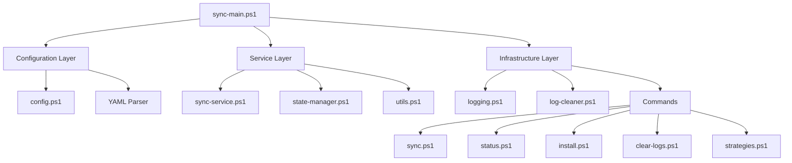
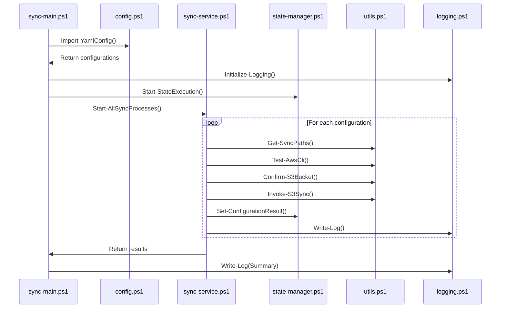
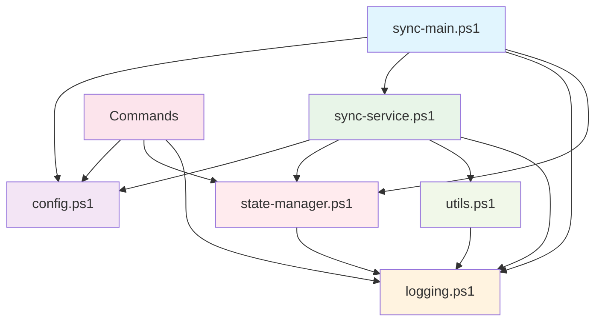
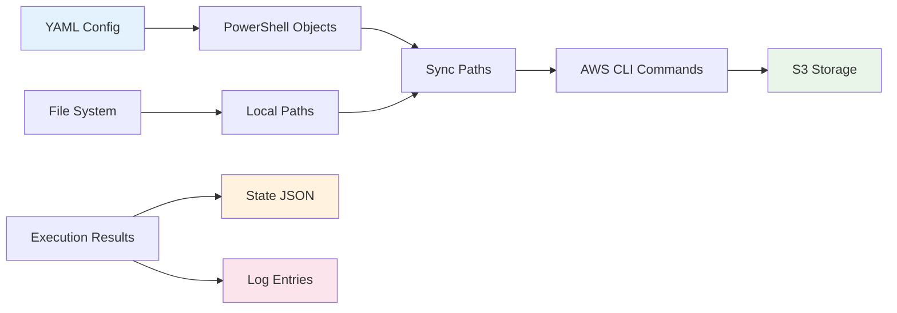
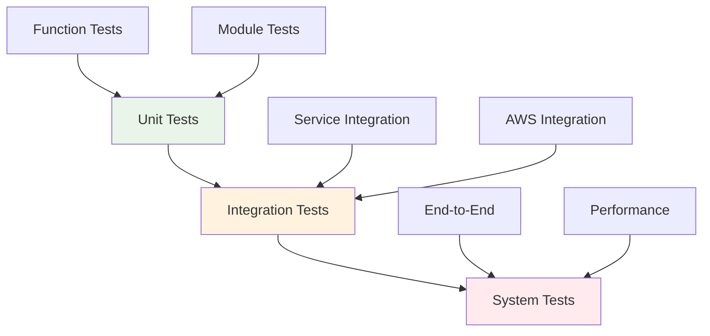

# 🏗️ AWS S3 Sync - Architecture & Developer Guide

> **🌐 Language**: English | [Español](README-es.md)

[](https://github.com/PowerShell/PowerShell)
[](https://aws.amazon.com/cli/)
[]()

> **Developer Documentation** for the modular AWS S3 synchronization system. This guide focuses on the technical architecture, component design, and development patterns used in the application.

---

## 📋 Table of Contents

- [🎯 System Overview](#-system-overview)
- [🏗️ Architecture Patterns](#️-architecture-patterns)
- [📁 Module Structure](#-module-structure)
- [🔄 Component Interaction](#-component-interaction)
- [💾 Data Flow](#-data-flow)
- [🔧 Development Guidelines](#-development-guidelines)
- [🛠️ Extension Points](#️-extension-points)
- [🧪 Testing Strategy](#-testing-strategy)

---

## 🎯 System Overview

The AWS S3 Sync system is built using a **modular architecture** with clear separation of concerns, following PowerShell best practices and enterprise patterns.

### 🎨 **Design Principles**

1. **📦 Single Responsibility**: Each module handles one specific aspect
2. **🔄 Dependency Injection**: Configuration and dependencies are injected
3. **💾 State Management**: Persistent state tracking across executions
4. **🛡️ Error Isolation**: Failures in one component don't affect others
5. **📊 Observable**: Comprehensive logging and monitoring
6. **⚙️ Configurable**: YAML-driven configuration management

### 🧱 **Core Components**



---

## 🏗️ Architecture Patterns

### 🎯 **Layered Architecture**

The system follows a **3-tier layered architecture**:

#### **1. Presentation Layer (Entry Points)**
- `sync-main.ps1` - Main orchestrator
- `src/commands/*.ps1` - CLI command implementations

#### **2. Business Logic Layer (Services)**
- `sync-service.ps1` - Core synchronization logic
- `state-manager.ps1` - State persistence and management
- `utils.ps1` - Business utilities and AWS operations

#### **3. Infrastructure Layer (Support)**
- `config.ps1` - Configuration management and YAML parsing
- `logging.ps1` - Centralized logging infrastructure
- `log-cleaner.ps1` - Log rotation and cleanup

### 🔧 **Module Pattern**

Each PowerShell module follows a consistent structure:

```powershell
#region Module Header
# Description and purpose
#endregion

#region Private Functions
# Internal implementation details
#endregion

#region Public Functions
# Exported API functions
#endregion

#region Initialization
# Module setup and validation
#endregion
```

### 💾 **State Management Pattern**

The system implements a **persistent state pattern** using JSON:

```json
{
  "lastExecution": { /* Global execution state */ },
  "configurationHistory": [ /* Per-config state history */ ]
}
```

---

## 📁 Module Structure

### ⚙️ **config.ps1 - Configuration Management**

**Purpose**: Centralized configuration loading and management

**Key Components**:
- `SyncConfiguration` class - Configuration container
- YAML parsing with `powershell-yaml` module
- Configuration validation and defaults

**Architecture Pattern**: Singleton Configuration Manager

```powershell
# Core class design
class SyncConfiguration {
    [string]$ConfigFile
    [int]$LogRetentionMonths
    [string]$LogDir
    [string]$StateFile
    [array]$SyncConfigurations
}
```

**Public API**:
- `Import-YamlConfig()` - Load configuration from YAML
- `Get-EnabledSyncConfigurations()` - Get active sync configs
- `Get-LogDirectory()`, `Get-StateFile()` - Configuration accessors

### 🔄 **sync-service.ps1 - Core Business Logic**

**Purpose**: Orchestrates the synchronization process

**Key Components**:
- Process orchestration
- AWS S3 interaction
- Error handling and recovery
- Result aggregation

**Architecture Pattern**: Service Layer with Command Pattern

```powershell
# Main orchestration functions
function Start-AllSyncProcesses($TargetDate)    # Process all configs
function Start-SyncProcess($TargetDate, $Config) # Process single config
```

**Workflow Design**:
1. **Validation Phase**: Check prerequisites and paths
2. **Execution Phase**: Run AWS S3 sync with options
3. **Result Phase**: Capture and log results
4. **State Phase**: Update persistent state

### 💾 **state-manager.ps1 - State Persistence**

**Purpose**: Manages application state across executions

**Key Components**:
- JSON-based state persistence
- Execution history tracking
- Configuration-specific state management
- State reporting and analytics

**Architecture Pattern**: Repository Pattern for State

```powershell
# State operations
function Get-State()                    # Load current state
function Set-State($StateData)          # Persist state
function Start-StateExecution($Date)    # Begin new execution
function Set-ConfigurationResult(...)   # Record config result
function Get-StateReport()              # Generate state report
```

**State Schema**:
```json
{
  "lastExecution": {
    "timestamp": "ISO-8601",
    "success": "boolean",
    "totalConfigurations": "number",
    "successfulConfigurations": "number",
    "failedConfigurations": "number"
  },
  "configurationHistory": [{
    "name": "string",
    "timestamp": "ISO-8601",
    "targetDate": "string",
    "success": "boolean",
    "localPath": "string",
    "s3Path": "string",
    "duration": "timespan",
    "filesTransferred": "number",
    "message": "string"
  }]
}
```

### 🔧 **utils.ps1 - Utility Functions**

**Purpose**: Reusable utility functions and AWS operations

**Key Components**:
- AWS CLI integration
- S3 bucket management
- Path construction
- File system operations

**Architecture Pattern**: Utility/Helper Module

```powershell
# Core utilities
function Test-AwsCli()                  # Verify AWS CLI availability
function Confirm-S3Bucket($Name)        # Ensure S3 bucket exists
function Get-SyncPaths($Date, $Config)  # Build sync paths
function Invoke-S3Sync($Local, $S3)     # Execute S3 sync
```

### 📝 **logging.ps1 - Logging Infrastructure**

**Purpose**: Centralized logging with rotation

**Key Components**:
- Monthly log rotation
- Multi-level logging (INFO, WARNING, ERROR, SUCCESS)
- Automatic log cleanup

**Architecture Pattern**: Infrastructure Service

```powershell
# Logging API
function Write-Log($Message, $Level)     # Write log entry
function Initialize-Logging()           # Setup logging
function Remove-OldLogs()               # Log rotation
```

### 🧹 **log-cleaner.ps1 - Log Management**

**Purpose**: Advanced log cleanup and maintenance

**Key Components**:
- Configurable retention policies
- Space management
- Log archiving capabilities

**Architecture Pattern**: Maintenance Service

### 📁 **commands/ - CLI Commands**

**Purpose**: Command-line interface implementations

**Components**:
- `sync.ps1` - Manual synchronization command
- `status.ps1` - System status reporting
- `install.ps1` - Prerequisites installation
- `clear-logs.ps1` - Log cleanup utilities
- `strategies.ps1` - Alternative sync strategies

**Architecture Pattern**: Command Pattern with Facade

---

## 🔄 Component Interaction

### 📊 **Execution Flow**



### 🔗 **Dependency Graph**



---

## 💾 Data Flow

### 📥 **Input Data Sources**

1. **YAML Configuration** (`sync-config.yaml`)
   - Global settings
   - Sync configurations
   - AWS parameters

2. **Command Line Parameters**
   - Target date
   - Execution options

3. **State File** (`state.json`)
   - Previous execution history
   - Configuration state

### 📤 **Output Data Sinks**

1. **Log Files** (`log/sync_YYYY-MM.log`)
   - Execution logs
   - Error details
   - Performance metrics

2. **State File** (`state.json`)
   - Updated execution state
   - Configuration results

3. **AWS S3**
   - Synchronized files
   - Folder structures

### 🔄 **Data Transformation Pipeline**



---

## 🔧 Development Guidelines

### 📝 **Coding Standards**

#### **PowerShell Best Practices**
- Use **Approved Verbs** for function names (`Get-`, `Set-`, `Start-`, `Stop-`)
- Implement **Parameter Validation** with `[ValidateSet]`, `[ValidateScript]`
- Use **Splatting** for complex parameter passing
- Implement **Error Handling** with `try/catch/finally`

#### **Function Design**
```powershell
function Verb-Noun {
    param(
        [Parameter(Mandatory = $true)]
        [ValidateNotNullOrEmpty()]
        [string] $RequiredParam,
        
        [Parameter(Mandatory = $false)]
        [ValidateSet("Option1", "Option2")]
        [string] $OptionalParam = "Option1"
    )
    
    try {
        # Implementation
        return $result
    }
    catch {
        Write-Log -Message "Error in Verb-Noun: $_" -Level "ERROR"
        throw
    }
}
```

#### **Error Handling Pattern**
```powershell
try {
    # Main logic
    $result = Invoke-Operation
    Write-Log -Message "Operation successful" -Level "SUCCESS"
    return $result
}
catch {
    $errorMsg = "Operation failed: $_"
    Write-Log -Message $errorMsg -Level "ERROR"
    
    # For non-critical errors, continue processing
    if ($ContinueOnError) {
        return $null
    }
    
    # For critical errors, halt execution
    throw $errorMsg
}
```

### 🧪 **Testing Approach**

#### **Unit Testing Structure**
```powershell
# Test file: Tests/config.tests.ps1
Describe "Configuration Management" {
    Context "YAML Loading" {
        It "Should load valid YAML configuration" {
            $config = Import-YamlConfig -ScriptRoot $testRoot
            $config | Should -Not -BeNullOrEmpty
        }
        
        It "Should validate required fields" {
            { Import-YamlConfig -ScriptRoot $invalidRoot } | Should -Throw
        }
    }
}
```

#### **Integration Testing**
```powershell
# Test file: Tests/integration.tests.ps1
Describe "End-to-End Synchronization" {
    BeforeAll {
        # Setup test environment
        $testConfig = New-TestConfiguration
        $testFiles = New-TestFiles
    }
    
    It "Should synchronize test files to S3" {
        $result = Start-SyncProcess -TargetDate $testDate -SyncConfig $testConfig
        $result | Should -BeTrue
    }
    
    AfterAll {
        # Cleanup test resources
        Remove-TestFiles
    }
}
```

---

## 🛠️ Extension Points

### 🔌 **Adding New Commands**

Create new commands in `src/commands/`:

```powershell
# src/commands/new-command.ps1
<#
.SYNOPSIS
    New command for the AWS S3 Sync system
#>

param(
    [Parameter(Mandatory = $false)]
    [string] $Parameter1
)

# Get project root (two levels up from src/commands)
$ProjectRoot = Split-Path (Split-Path $PSScriptRoot -Parent) -Parent

# Import required modules
. (Join-Path $ProjectRoot "src\config.ps1")
. (Join-Path $ProjectRoot "src\logging.ps1")

function Invoke-NewCommand {
    # Implementation
}

# Execute if called directly
if ($MyInvocation.InvocationName -eq $MyInvocation.MyCommand.Name) {
    Invoke-NewCommand
}
```

### 🔧 **Adding New Sync Strategies**

Extend `src/commands/strategies.ps1`:

```powershell
function Invoke-CustomSyncStrategy {
    param(
        [string] $LocalPath,
        [string] $S3Path,
        [array] $Options
    )
    
    # Custom synchronization logic
    return @{
        Success = $true
        FilesTransferred = $count
        Message = "Custom sync completed"
    }
}
```

### 📊 **Adding New State Reporters**

Extend `src/state-manager.ps1`:

```powershell
function Get-CustomStateReport {
    $state = Get-State
    
    # Custom report generation
    return @{
        CustomMetric1 = $value1
        CustomMetric2 = $value2
    }
}
```

### 🔍 **Adding New Validators**

Extend `src/utils.ps1`:

```powershell
function Test-CustomValidation {
    param(
        [PSCustomObject] $Config
    )
    
    # Custom validation logic
    if (-not $validationPassed) {
        throw "Custom validation failed: $reason"
    }
}
```

---

## 🧪 Testing Strategy

### 🎯 **Testing Pyramid**



### 🔬 **Test Categories**

#### **1. Unit Tests**
- Individual function validation
- Error handling verification
- Input/output validation
- Mock external dependencies

#### **2. Integration Tests**
- Module interaction testing
- AWS CLI integration
- File system operations
- State persistence validation

#### **3. System Tests**
- Complete workflow testing
- Performance benchmarking
- Error recovery testing
- Multi-configuration scenarios

### 🏃 **Running Tests**

```powershell
# Install Pester if not available
if (-not (Get-Module -ListAvailable Pester)) {
    Install-Module -Name Pester -Force -Scope CurrentUser
}

# Run all tests
Invoke-Pester -Path "Tests/" -OutputFormat "NUnitXml" -OutputFile "TestResults.xml"

# Run specific test category
Invoke-Pester -Path "Tests/unit/" -Tag "Unit"
Invoke-Pester -Path "Tests/integration/" -Tag "Integration"
```

---

## 🚀 **Development Workflow**

### 🔄 **Recommended Development Process**

1. **📋 Planning**
   - Define requirements and scope
   - Design component interfaces
   - Plan testing strategy

2. **🔧 Implementation**
   - Follow coding standards
   - Implement core functionality
   - Add comprehensive error handling

3. **🧪 Testing**
   - Write unit tests first (TDD)
   - Implement integration tests
   - Perform system testing

4. **📝 Documentation**
   - Update inline documentation
   - Update this architecture guide
   - Update user documentation

5. **🚀 Deployment**
   - Validate in test environment
   - Deploy to production
   - Monitor execution logs

### 🛠️ **Development Environment Setup**

```powershell
# Clone repository
git clone <repository-url>
cd aws-s3-sync

# Install development dependencies
.\src\commands\install.ps1

# Install testing framework
Install-Module -Name Pester -Force -Scope CurrentUser

# Run initial validation
.\src\commands\status.ps1
```

---

## 📚 **Additional Resources**

### 🔗 **Related Documentation**
- [User Guide](../README.md) - End-user documentation
- [Configuration Guide](../sync-config.yaml) - YAML configuration examples
- [PowerShell Best Practices](https://docs.microsoft.com/en-us/powershell/scripting/learn/ps101/00-introduction)
- [AWS CLI Documentation](https://docs.aws.amazon.com/cli/)

### 🤝 **Contributing**
- Follow the coding standards outlined in this document
- Write comprehensive tests for new features
- Update documentation for any architectural changes
- Use descriptive commit messages

### 📞 **Support**
For technical questions about the architecture:
- Review this documentation first
- Check existing unit and integration tests
- Examine the state and log files for runtime information
- Follow the troubleshooting patterns in the main user guide

---

**🎯 This architectural guide serves as the foundation for understanding, maintaining, and extending the AWS S3 Sync system. For user-focused documentation, see the main [README.md](../README.md).**